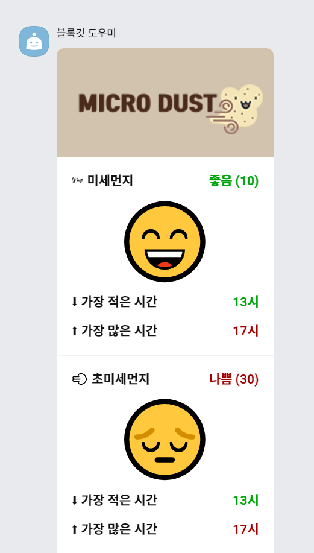
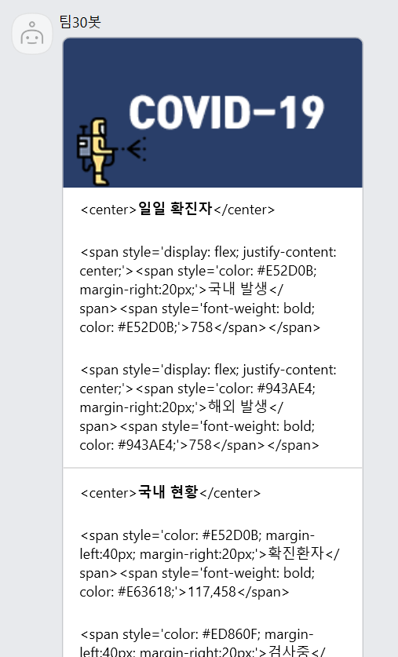
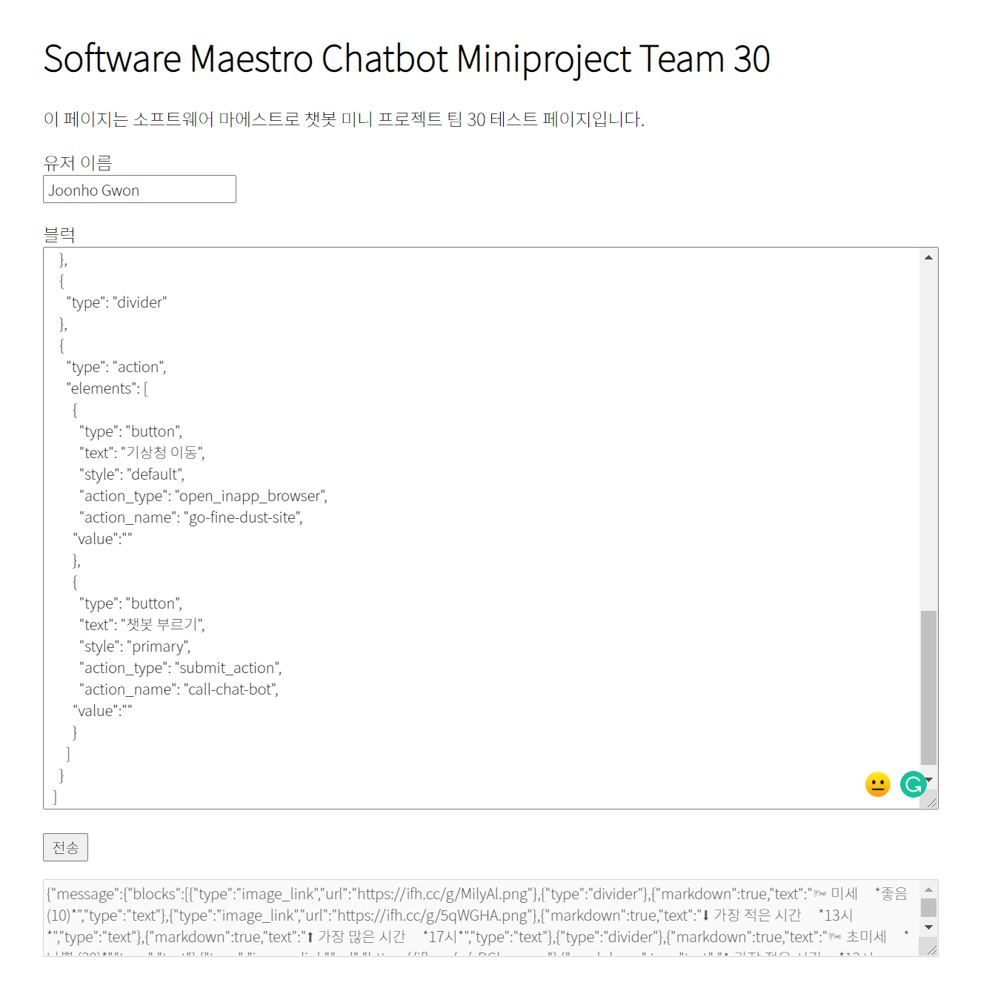

# SWM MINI-PROJECT : Morning briefing Chat-bot

## Contributor
- [`권준호`](https://github.com/unknownpgr) : Leader, Server
- [`김영배`](https://github.com/canoe726) : Block-kit, README
- [`박유천`](https://github.com/Park6000) : Crawling
- [`이도원`](https://github.com/2dowon) : Block-kit, README
- [`정용훈`](https://github.com/wjddydgns99) : Crawling
- [`황희영`](https://github.com/hehehwang) : Server


## Develop Process

### 챗봇 시나리오

👋 안녕하세요 30팀 '네트워크 연결상태 좋은' 팀 입니다.

저희는 아침에 밖에 나가기 전 필요한 간단 정보들을 모아서 보여주는 챗봇을 만들었습니다.

아침에 밖에 나가기전 필요한 정보가 무엇일지 생각한 끝에 4가지 정보가 가장 유용한 정보라고 생각하였습니다.


#### 1. 오늘의 날씨

```
챗봇 호출 시 정시를 기준으로 30분 마다 기상청에서 발표한 날씨 정보를 보여줍니다.

설정에서 원하는 지역을 선택하면 원하는 지역의 날씨를 볼 수 있습니다.

🌡 기온, 👧 체감온도, 🔺 최고온도, 🔻 최저온도, 💦 현재습도, 🌂 강수확률,

비가 올 확률이 가장 높은 시간 정보를 얻을 수 있습니다.
```


#### 2. 미세먼지

```
챗봇 호출 시 정시를 기준으로 30분 마다 한국환경공단에서 수집한 미세먼지 상태를 보여줍니다.

🌬 미세먼지, 🌬 초미세먼지, 미세 또는 초미세먼지가 ⬇ 가장 적은시간, ⬆ 가장 많은시간을 알려줍니다.
```


#### 3. 코로나 상황판

```
코로나가 현재 어떤 상황인지 한눈에 볼 수 있도록 수집한 정보를 보여줍니다.

일일확진자(🇰🇷 국내발생, 🌏 해외유입) 및 국내현황(😷 확진환자, ⚠️ 검사중, ✅ 격리해제, 🙏🏻 사망)을 보여주고

더 자세한 정보를 보고 싶다면 COVID-19 홈페이지 링크로 이동할 수 있습니다.
```


#### 4. 뉴스 헤더라인

```
오늘의 네이버 뉴스 헤더라인을 보여줍니다.

🤦 정치, 💸 경제, 🔬 IT/과학 3가지 카테고리 내에서 뉴스의 헤더라인을 보여줍니다.

더 많은 뉴스를 보고 싶다면 네이버 뉴스로 이동할 수 있습니다.
```


<hr>


### 챗봇 화면 페이지

> 아침브리핑 메인 | 아침브리핑 설정 화면

<div>
  
  &nbsp;
  
  &nbsp;
  &nbsp;
  
</div>
<br>

> 오늘의 날씨 | 미세먼지 화면

<div>
  
  &nbsp;
  &nbsp;
  
  &nbsp;
  
</div>
<br>


> 코로나 | 뉴스 화면
<div>
  
  &nbsp;
  &nbsp;
  
</div>
<br>


### 크롤링

1. 크롤러 제작

- 오늘의 날씨, 미세먼지 : Python ''를 사용하여 네이버 날씨 페이지에서 각 지역에 대한 날씨 및 미세먼지에 대한 정보를 가져옵니다.

- 코로나 상황판 : 네이버 검색창에 '코로나 현황'을 검색한 창에서 1.확진환자 2.격리해제 3.사망자 4.검사진행 와 각각의 일일 변화량, 그리고 일일확진자(국내발생, 해외유입)을 가져옵니다.

- 뉴스 헤더라인 : 네이버 뉴스 헤드라인에서 정치, 경제, 과학/IT 3개의 섹션 각각에서 3개의 사진이 있는 기사를 불러옵니다.

> 크롤링 예제

<div>
  
  &nbsp;
  
</div>
<br>


2. 크롤러 동작 프로세스

- Beautiful Soup → 네이버 웹 페이지 접속 → 검색 창에서 검색 및 헤드라인 정보 크롤링 → JSON 형태로 구름 IDE에 저장


3. 사용한 기술스택

  


### 서버 구현

1. 서버 동작 프로세스
   1. `/chatbot` 라우트에서 `POST` request를 받으면 모든 사용자에게 채팅방을 생성하고 브리핑 메세지를 전송합니다.
      (이후 설정된 시각에 도달하면 해당 유저에게 브리핑 메세지 전송)
   2. 메세지에 담길 정보는 파이썬 크롤러가 미리 크롤링해둔 json파일을 읽어서 메세지 블록에 넣은 후, 정보를 제공합니다.
   3. 브리핑 메세지에 달려있는 분야별 자세히보기 버튼에서 보내는 콜백을 서버에서 받은 후, 해당하는 메세지를 유저에게 전송합니다.
   4. 설정 버튼을 눌렀을 시엔 리퀘스트를 받고 설정 모달을 보내서 유저의 설정정보를 받아옵니다.
2. 사용한 기술스택

   


### 블록킷 에러 핸들링
블록킷 빌더(https://www.kakaowork.com/block-kit-builder)로 작성된 블록과 실제 수신된 메시지에 차이가 발생했습니다. (좌: 블록킷 빌더에서 보이는 채팅 / 우 : 실제 카카오워크에서 보이는 채팅)

<div>

&nbsp;

</div>

차이점:
- 이모지 흑백
- 대부분의 HTML 태그 무시

해당 버그를 리포트한 후, 실제 보여지는 블록을 시뮬레이션 하기 위한 테스트 페이지를 작성했습니다.



위 페이지에서 워크스페이스 내에 메시지를 보내고 싶은 사람의 이름과 보낼 블럭킷 `JSON`을 입력한 후, 전송 버튼을 누르면 메시지가 전송된 후 서버로부터의 응답을 아래에 표시해줍니다.

### 개발 환경

구름 컨테이너에서 여러 사람이 함께 작업하면 충돌이 발생할 확률이 매우 높습니다. 특히 Git을 사용해서 관리를 할때 다른 사람이 수정한, 원하지 않는 수정사항이 commit에 포함될 가능성이 높습니다. 따라서 로컬에서 수정하고, 그것이 곧바로 컨테이너에 반영되도록 간단한 CI/CD를 구성했습니다.

1. 컨테이너 내부의 서버는 `supervisor`를 사용하여 동작합니다.
2. `GitHub`에서 `Webhook`을 등록, `push` 이벤트 발생 시 서버에 `POST` 요청을 보냅니다.
3. 서버에는 해당 요청을 받을 경우 `git pull`을 수행하는 쉘 스크립트를 실행합니다.
4. 그러면 `git pull`이 발생하면서 서버 내부의 파일들이 변경됩니다.
5. `supervisor`가 서버 내부 파일의 변경을 감지하여 서버를 재시작합니다.

즉, 로컬에서 수정한 후 `push`하면 수 초 내로 컨테이너에서 `pull`이 이루어지고 서버가 재시작됩니다.

좀 더 자유로운 프로세스 관리를 위해 `tmux`를 이용합니다.
- `tmux ls` 명령어를 통해 생성된 `tmux` 세션들을 볼 수 있습니다.
- `tmux attach -t [세션 번호]` 명령어를 통해 세션에 접속할 수 있습니다.
- `ctrl+b, d` 단축키를 통해 접속한 세션에서 세션을 종료하지 않으면서 빠져나올 수 있습니다.
    - 이렇게 할 경우 세션은 백그라운드에서 동작합니다.
- 세션을 종료하고 싶을 경우 세션에 접속한 후 (일반적인 쉘과 마찬가지로) `exit`명령어로 세션을 종료하면 됩니다.
